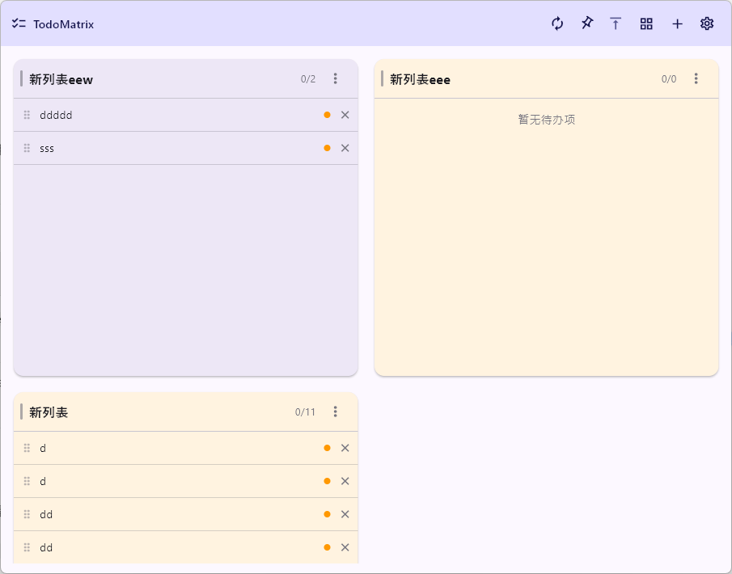
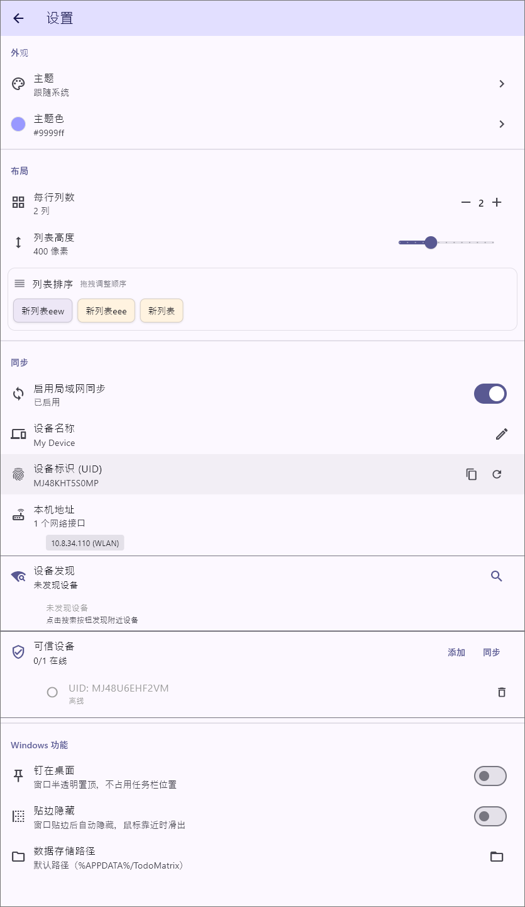

# Todo Matrix

一个双端待办事项管理应用，支持 Windows 和 Android 平台，具备局域网多设备同步功能。

## 功能特性

- **多列表支持** - 自定义待办列表，可以使用成四象限待办
- **局域网同步** - 可信设备之间自动同步数据
- **主题定制** - 支持浅色/深色主题，自定义主题色
- **Windows 特性** - 钉在桌面、边缘隐藏、自定义透明度

## 界面截图



## 自己构建

### 开发环境

- Flutter 3.x
- Dart 3.x

### 快速开始

```bash
# 克隆项目
git clone <repository-url>
cd todo_matrix

# 安装依赖
flutter pub get

# 运行调试版本
flutter run
```

### 打包

#### Windows

```bash
flutter build windows --release
```

输出位置：`build/windows/x64/runner/Release/`

#### Android

1. 生成签名密钥（首次）：
```bash
keytool -genkey -v -keystore todo-matrix-key.jks -keyalg RSA -keysize 2048 -validity 10000 -alias todo-matrix
```

2. 在 `android/` 目录下创建 `key.properties`：
```properties
storePassword=你的密钥库密码
keyPassword=你的密钥密码
keyAlias=todo-matrix
storeFile=密钥文件路径
```

3. 打包：
```bash
flutter build apk --release
```

输出位置：`build/app/outputs/flutter-apk/app-release.apk`

## 同步功能说明

- 设备通过 UDP 广播在局域网内发现彼此
- 只有互相添加为"可信设备"的设备之间才能同步数据
- 同步基于时间戳的冲突解决策略（最新修改优先）
- 支持删除同步（墓碑机制）

## 许可证

- 版权所有 (c) 2025 PortianLiu (GitHub: https://github.com/PortianLiu)
- 本项目基于 **Mozilla Public License 2.0 (MPL 2.0)** 开源，完整协议见仓库根目录 [LICENSE](LICENSE) 文件；
